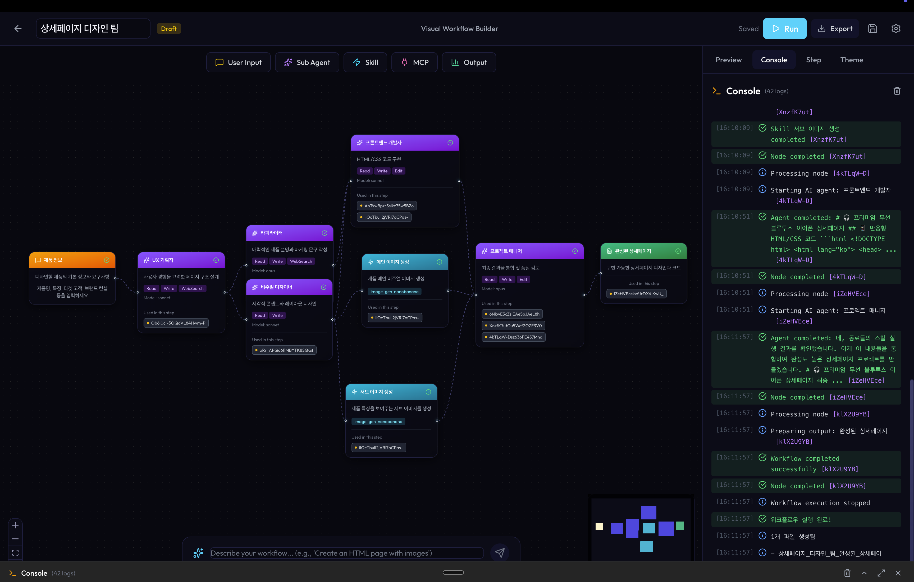
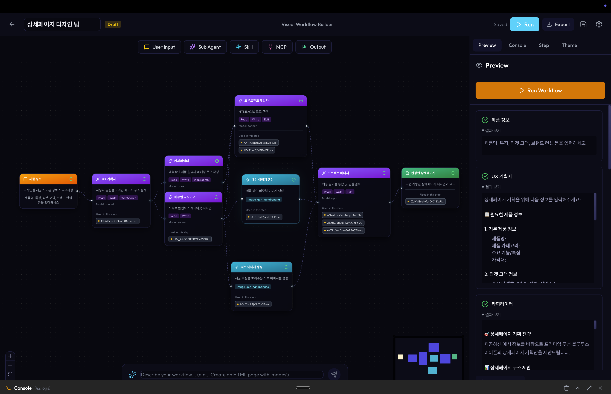

# Million Agent - Visual Workflow Builder

Claude Code 기반의 비주얼 워크플로우 빌더입니다. 노드 기반 UI로 AI 에이전트 워크플로우를 설계하고 실행할 수 있습니다.

## Claude Code 플러그인

이 프로젝트는 Claude Code 플러그인으로 사용할 수 있습니다.

### 포함된 스킬

| 스킬 | 설명 |
|------|------|
| `/visual-builder` | Visual Workflow Builder 실행 |
| `/git-commit-push` | Git 커밋 및 푸시 |
| `/skill-creator` | 새로운 스킬 생성 |
| `/subagent-creator` | 서브 에이전트 생성 |
| `/slash-command-creator` | 슬래시 커맨드 생성 |
| `/hook-creator` | 훅 생성 |

### 사용법

Claude Code에서 다음과 같이 사용:

```
/visual-builder
```

## 스크린샷

### 워크플로우 편집기


### 실행 결과


## 기능

- **노드 기반 워크플로우 설계**: 드래그 앤 드롭으로 워크플로우 구성
- **다양한 노드 타입**: Input, Subagent, Skill, MCP, Output
- **실시간 실행**: 로컬에서 워크플로우 실행 및 결과 확인
- **콘솔 로그**: 실행 과정 실시간 모니터링
- **파일 다운로드**: 결과물 마크다운 파일로 다운로드

## 시작하기

### 설치

```bash
npm install
```

### 환경 설정

`.env` 파일에 API 키 설정:

```env
VITE_ANTHROPIC_API_KEY=your-api-key-here
```

### 실행

```bash
npm run dev
```

## 기술 스택

- React + TypeScript
- Vite
- React Flow (@xyflow/react)
- Tailwind CSS
- Anthropic SDK

## 라이선스

MIT
